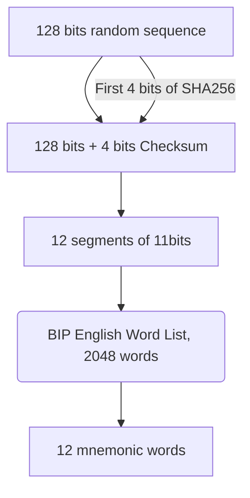
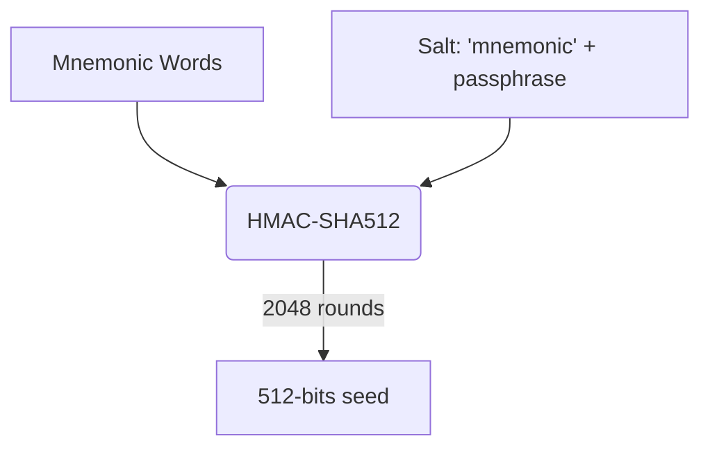

## Bitcoin

### Bitcoin consists of
 - A decentralized peer-to-peer network (**the bitcoin protocol**)
 - A public transaction ledger (**the blockchain**)
 - A set of rules for independent transaction validation and currency issuance (**consensus rules**)
 - A mechanism for reaching global decentralized consensus on the valid blockchain (**Proof-of-Work algorithm**)

### History of Bitcoin
 - "Bitcoin: A Peer-to-Peer Electronic Cash System", 2008, Satoshi Nakamoto
 - "Byzantine Generals" problem: Satoshi Nakamoto's solution, which uses the concept of Proof-of-Work to achieve consensus without a central trusted authority.

### How Bitcoin Works

**Traditional banking and payment system** - Centralized
[How does money transfer work?](https://www.quora.com/How-does-money-transfer-between-banks-and-different-countries-work)

### Keys and Address

#### Private Key
256 bits as 64 hexadecimal digits:

    1E99423A4ED27608A15A2616A2B0E9E52CED330AC530EDCC32C8FFC6A526AEDD

#### Public Key

[Elliptic Curve Cryptography](https://www.wolframalpha.com/input/?i=Elliptic%20Curve)

> K=k*G

k is the private key, G is the generator point.

#### Bitcoin Address
 - A bitcoin address can represent the owner of a private/public key pair, or it can represent some‐ thing else, such as a payment script. 
 - The bitcoin address is what appears most commonly in a transaction as the “recipient” of the funds.
 - A Bitcoin address is a unique number that “holds” bitcoin currency. You use the address to receive and send bitcoins.

> A = RIPEMD160(SHA256(K))  

where K is the public key and A is the resulting bitcoin address.

**P2PKH (pay-to-public-key hash) Address**
 - bitcoin address that begin with '1'
 - one public key hash and one private key signature as proof of ownership

**P2SH (pay-to-script hash)**
 - bitcoin address that begin with '3'
 - require M signatures from a total of N keys
> script hash = RIPEMD160(SHA256(script))

#### Encoding & Format

**Base58 encoding**
Base58 is Base64 without the 0 (number zero), O (capital o), l (lower L), I (capital i), and the symbols “+” and “/”.

**Keys formats**
 - private key
	 - raw 32 bytes
	 - hex 64 hexadecimal digits
	 - WIF prefix '5', Base58Check encoding: Base58 with version prefix of 128- and 32-bit checksum
 - public key
	 - a point (x, y) on an elliptic curve 

#### Vanity Addresses
Vanity addresses are valid bitcoin addresses that contain human-readable messages.

### Wallet

**Bitcoin wallet** contains keys, not coins. Wallets are keychains containing pairs of private/public keys. Users sign transactions with the keys. The coins are stored on the blockchains in the form of transaction output.

Two primary types of wallets, distinguished by whether the keys they contain are lated to each other or not : 
 1. Nondeterministic Wallet, where each key is independently generated from a random number.
2. Deterministic Wallet, where all keys are derived from a single master key. The most commonly used derivation method uses a tree-like structure an is known as a **hierarchical deterministic** or HD wallet.

#### Mnemonic Code Words (BIP-39)

 1. Create a random sequence of 128 to 256 bits.
 2. Create a checksum of the random sequence by taking the first bits of its SHA256 hash.
 3. Add the checksum to the end of the random sequence.
 4. Divide the sequence into sections of 11bits
 5. Map each 11-bit value to a word from the predefined dictionary of 2048 words.
 6. The mnemonic code is the sequence of words.



| Entropy (bits) | Checksum (bits) | Entropy + Checksum (bits) | 	Mnemonic Length (words) |
|--|--|--|--|
| 128 | 4 | 132 | 12 |
| 160 | 5 | 165 | 15 |
| 192 | 6 | 198 | 18 |
| 224 | 7 | 231 | 21 |
| 256 | 8 | 264 | 24 |




### Transaction

Sample transaction in JSON:
```json
{
  "version": 1,
  "locktime": 0,
  "vin": [
    {
      "txid": "7957a35fe64f80d234d76d83a2a8f1a0d8149a41d81de548f0a65a8a999f6f18",
      "vout": 0,
      "scriptSig": "3045022100884d142d86652a3f47ba4746ec719bbfbd040a570b1deccbb6498c75c4ae24cb02204 b9f039ff08df09cbe9f6addac960298cad530a863ea8f53982c09db8f6e3813[ALL] 0484ecc0d46f1918b30928fa0e4ed99f16a0fb4fde0735e7ade8416ab9fe423cc5412336376789d1 72787ec3457eee41c04f4938de5cc17b4a10fa336a8d752adf",
      "sequence": 4294967295
    }
  ],
  "vout": [
    {
      "value": 0.015,
      "scriptPubKey": "OP_DUP OP_HASH160 ab68025513c3dbd2f7b92a94e0581f5d50f654e7 OP_EQUALVERIFY OP_CHECKSIG"
    },
    {
      "value": 0.0845,
      "scriptPubKey": "OP_DUP OP_HASH160 7f9b1a7fb68d60c536c2fd8aeaa53a8f3cc025a8 OP_EQUALVERIFY OP_CHECKSIG"
    }
  ]
}
```

Transaction outputs consist of two parts:

 - An amount of bitcoin, denominated in satoshis, the smallest bitcoin
   unit
 - A cryptographic puzzle that determines the conditions required
   to spend the output  

The cryptographic puzzle is also known as a locking script, a witness script, or a scriptPubKey.

The first part of an transaction input is a pointer to an UTXO by reference to the transaction hash and sequence number where the UTXO is recorded in the blockchain.

#### Transaction Fees
Transaction fees are calculated based on the size of the transaction in kilobytes, not the value of the transaction in bitcoin. Transaction fees are collected by the miner who mines the block that records the transaction on the blockchain.
<!--stackedit_data:
eyJoaXN0b3J5IjpbLTU5NTcyOTg3NiwxOTQ2NDE0OTI4LC0xMD
U4MzU0OTI3LC0xMTc4NDk1NDY1LC0xMjM1Njc5MzM0LDEzODU3
NjAyNzksLTE2MDE0NDYxOTAsLTEwMzc5Njk1MiwtMTA0NzIzMz
gxNSwxMjQ0OTA3NDgyLC0xMzgxMTM3NzAyLC0zMDUzNzg0NTIs
LTUyMjgyMjA3NiwxNDMyNjc2OTA3LDE0NzAzMTY0NTIsLTE1ND
I3Mzg2NjQsLTExNjQ1MDM3OTMsLTEzNDAxMTk0MywtMjEyNTE1
MzI0OSwtMTgxNDM2NDUyN119
-->